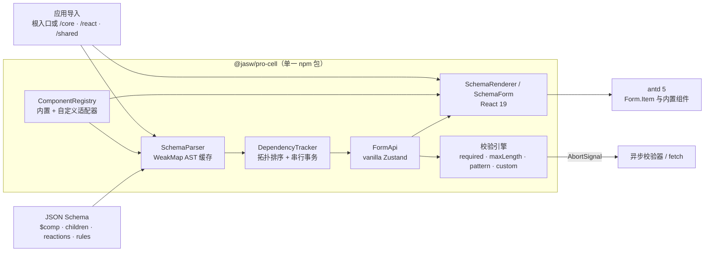

# @jasw/pro-cell

[GitHub 仓库](https://github.com/jasw555/pro-cell) · [问题反馈](https://github.com/jasw555/pro-cell/issues) · [更新记录](https://github.com/jasw555/pro-cell/blob/main/CHANGELOG.md)

`@jasw/pro-cell` 是面向 React 19 的 `$comp` Schema 表单/表格渲染器。它源于后台系统里反复出现的配置表单需求：结构由接口下发，联动和校验保持为 JSON，业务组件仍然可以按需注册。

当前版本为 `0.1.0`。npm 只发布 `@jasw/pro-cell`；`core`、`react`、`shared` 和 `examples` 是仓库内部 workspace。

## 安装

```bash
pnpm add @jasw/pro-cell antd react react-dom zustand @ant-design/v5-patch-for-react-19
```

要求：Node.js 20+、React 19.x、React DOM 19.x、antd 5.x、Zustand 5.x。

React 19 + antd 5 的应用入口应先加载 antd 官方兼容补丁（只需加载一次）：

```tsx
// src/main.tsx
import '@ant-design/v5-patch-for-react-19';
import { StrictMode } from 'react';
import { createRoot } from 'react-dom/client';
import { App } from './App';

const rootElement = document.getElementById('root');
if (rootElement === null) {
  throw new Error('找不到应用挂载节点');
}

createRoot(rootElement).render(
  <StrictMode>
    <App />
  </StrictMode>,
);
```

## 同一包的多入口

子路径不是独立 npm 包，也没有单独的版本或发布生命周期；它们都来自 `@jasw/pro-cell` 的同一个 tarball：

```ts
import { SchemaForm, createForm, registerComponent } from '@jasw/pro-cell';
import { DependencyTracker } from '@jasw/pro-cell/core';
import { SchemaRenderer, useForm } from '@jasw/pro-cell/react';
import { validateValue, required } from '@jasw/pro-cell/shared';
```

| 入口                    | 导出重点                                                                 |
| ----------------------- | ------------------------------------------------------------------------ |
| `@jasw/pro-cell`        | React 19 推荐入口、默认内置组件、根 SchemaParser、FormApi、Result 和错误 |
| `@jasw/pro-cell/core`   | `SchemaParser`、安全表达式、`DependencyTracker`、core 注册表             |
| `@jasw/pro-cell/react`  | `SchemaForm`、`SchemaRenderer`、`useForm`、Zustand FormApi、React 注册表 |
| `@jasw/pro-cell/shared` | Schema/校验类型、Result 工具、内置规则和路径工具                         |

每个入口均提供 ESM、CommonJS 和 `.d.ts`。普通 React 应用优先使用根入口；`core` 的注册表与根入口的 React 注册表相互独立，不要混用。

同一 tarball 也支持 CommonJS `require`，例如：

```js
const { createForm, SchemaForm } = require('@jasw/pro-cell');
const { DependencyTracker } = require('@jasw/pro-cell/core');
```

四个入口均携带对应的 TypeScript `.d.ts` 声明，不需要额外安装内部 workspace 包。

## 架构图

`@jasw/pro-cell` 是唯一发布单元。下图中的 `shared`、`core`、`react` 和 `examples` 在源码仓库中是私有 workspace；构建时前三者会被聚合进同一个包，并通过子路径提供模块化导入。



## React 快速开始

### Schema

```ts
// src/schema.ts
import type { SchemaNode } from '@jasw/pro-cell';

export const schema: SchemaNode = {
  $comp: 'Fragment',
  children: [
    {
      $comp: 'Select',
      name: 'accountType',
      props: {
        label: '账户类型',
        options: [
          { label: '个人', value: 'personal' },
          { label: '企业', value: 'business' },
        ],
      },
    },
    {
      $comp: 'Input',
      name: 'companyName',
      props: { label: '企业名称', placeholder: '企业账户请输入' },
      reactions: [
        {
          when: "{{$deps.accountType === 'business'}}",
          then: { setVisible: true, setDisabled: false },
          else: { setVisible: false, setDisabled: true, setValue: '' },
        },
      ],
    },
  ],
};
```

### 只渲染 Schema

```tsx
import type { ReactElement } from 'react';
import { SchemaForm } from '@jasw/pro-cell';
import { schema } from './schema';

export function AccountForm(): ReactElement {
  return <SchemaForm schema={schema} />;
}
```

不传 `form` 时，`SchemaForm` 会创建独立 FormApi，并在组件卸载时释放它。字段节点会自动包裹在 antd `Form.Item` 中；`props.label` 作为标签，规则错误作为 `help`。

### 自定义提交按钮

需要从页面调用 `validate` 或 `submit` 时，用 `useForm` 创建实例。`SchemaForm` 收到 `children` 后不会再次自动渲染 Schema，因此要显式放置 `SchemaRenderer`：

```tsx
import { useState, type ReactElement } from 'react';
import { Button, Space, Typography } from 'antd';
import { SchemaForm, SchemaRenderer, useForm, type FormSubmitHandler } from '@jasw/pro-cell';
import { schema } from './schema';

const save: FormSubmitHandler<{ saved: boolean }> = async (values, { signal }) => {
  const response = await fetch('/api/accounts', {
    method: 'POST',
    headers: { 'content-type': 'application/json' },
    body: JSON.stringify(values),
    signal,
  });
  if (!response.ok) {
    throw new Error(`保存失败（HTTP ${response.status}）`);
  }
  return { saved: true };
};

export function AccountFormWithSubmit(): ReactElement {
  const [message, setMessage] = useState('');
  const form = useForm({
    schema,
    initialValues: { accountType: 'personal', companyName: '' },
    onSubmit: save,
  });

  const submit = async (): Promise<void> => {
    const result = await form.submit();
    setMessage(result.ok ? '保存成功' : result.error.message);
  };

  return (
    <SchemaForm schema={schema} form={form}>
      <Space direction="vertical" style={{ width: '100%' }}>
        <SchemaRenderer schema={schema} form={form} />
        <Button type="primary" onClick={() => void submit()}>
          保存
        </Button>
        {message ? <Typography.Text>{message}</Typography.Text> : null}
      </Space>
    </SchemaForm>
  );
}
```

也可以把 `onSubmit` 放在 `<SchemaForm options={{ onSubmit }}>` 中；若同时传入 `onSubmit` 属性，属性值优先。

## `$comp` 协议

```ts
interface SchemaNode {
  readonly $comp: string;
  readonly name?: string;
  readonly props?: Readonly<Record<string, unknown>>;
  readonly children?: readonly SchemaNode[];
  readonly rules?: readonly ValidationRuleConfig[];
  readonly reactions?: readonly ReactionConfig[];
}
```

示例：

```json
{
  "$comp": "Input",
  "name": "user.phone",
  "props": { "label": "手机号", "placeholder": "请输入手机号" },
  "rules": [
    { "type": "required", "message": "请输入手机号" },
    { "type": "pattern", "value": "^1\\d{10}$" }
  ]
}
```

字段说明：

- `$comp` 必须是已注册组件名。默认组件：`Input`、`Select`、`Switch`、`Table`、`Fragment`。
- `name` 是稳定字段名；存在 `rules` 或 `reactions` 时必填。点号路径按扁平键保存，例如 `user.phone` 不会自动转换成嵌套对象。
- `props` 传递静态组件属性；渲染器会消费 `label`，不会把 `name`、`rules`、`reactions`、`children` 透传给组件。
- `children` 可以嵌套任意深度，解析器按 O(N) 递归遍历。
- `props.value`/`props.checked` 在无 `name` 节点上仍是合法静态属性；有 `name` 时，运行时表单值会覆盖对应受控属性。

## 联动与安全表达式

```json
{
  "$comp": "Input",
  "name": "shippingAddress",
  "props": { "label": "收货地址" },
  "reactions": [
    {
      "when": "{{$deps.sameAs === true}}",
      "then": {
        "setVisible": false,
        "setValue": "{{$deps.billingAddress}}"
      },
      "else": { "setVisible": true }
    }
  ]
}
```

支持：`$deps.path`、字符串、数字、`true`、`false`、`null`、`===`、`!==`、`&&`、`||`、`!` 和括号。完整 `{{...}}` 字符串会被求值，普通字符串保持字面量。表达式由递归下降解析器处理，不使用 `eval`、`new Function`、函数调用或任意 JavaScript。单条表达式最多 4096 个字符，括号与连续一元运算最多嵌套 64 层；超限会返回 `ExpressionError`，不会把解析器的栈错误泄漏给应用。

依赖图方向是“依赖字段 → 被影响字段”：A 读取 B 就建立 `B → A`。创建表单或注册 Schema 时会预编译 `when/then/else` 并用 Kahn 拓扑排序检查环；检测到 `A -> B -> A` 等环会抛出 `DependencyCycleError`。通知使用串行队列，`Object.is` 相同值不会触发 reaction，动作始终按 `setVisible → setDisabled → setValue` 执行。`maxTransactionDepth` 限制的是一条因果链的级联深度，不是同一层受影响字段的数量，因此宽扇出的合法联动不会被误判为运行时循环。

## FormApi

```ts
const form = createForm({
  schema,
  initialValues: { accountType: 'personal' },
});

const update = form.setValue('accountType', 'business');
if (!update.ok) {
  console.error(update.error.code, update.error.message);
}

const validation = await form.validate();
console.log(validation.valid, validation.errors);
form.reset();
form.dispose();
```

常用方法：

| 方法                     | 作用                                                    |
| ------------------------ | ------------------------------------------------------- |
| `getValue/getValues`     | 读取单值或全部扁平值                                    |
| `setValue/setValues`     | 更新值并触发联动；返回 `Result`                         |
| `setVisible/setDisabled` | 手动改变字段显示或禁用状态                              |
| `getFieldState`          | 读取 `value/errors/visible/disabled/validating/touched` |
| `validateField/validate` | 校验字段或整张表单                                      |
| `submit`                 | 校验通过后执行 `onSubmit`                               |
| `reset`                  | 取消未完成任务并恢复初始值或指定值                      |
| `subscribe`              | 订阅完整状态快照                                        |
| `dispose`                | 取消异步操作并释放资源                                  |

隐藏字段只卸载 React 节点，值仍保留；禁用字段只接收 `disabled` 属性，不会自动清空值。全表单校验仍会执行隐藏或禁用字段的静态规则；条件校验请使用 `custom` 校验器读取 `context.values` 后自行短路。

## 校验

### 内置规则

```json
"rules": [
  { "type": "required", "message": "必填" },
  { "type": "maxLength", "value": 20 },
  { "type": "pattern", "value": "^[A-Z]{2}$", "flags": "i" }
]
```

`required` 检查 `undefined`、`null`、空字符串和空数组；`maxLength` 检查字符串/数组长度；`pattern` 检查字符串格式。除 `required` 外，规则对空值跳过。规则按声明顺序短路，错误会显示在 `Form.Item` 下。

### 异步规则

Schema 只保存 JSON 可序列化的 ID：

```json
{ "type": "custom", "validatorId": "phoneAvailable" }
```

运行时注入：

```ts
import { err, ok, ValidationError, createForm } from '@jasw/pro-cell';
import type { ValidatorRegistry } from '@jasw/pro-cell';

const validators: ValidatorRegistry = {
  phoneAvailable: async (value, { signal }) => {
    const response = await fetch(`/api/phone?q=${encodeURIComponent(String(value ?? ''))}`, {
      signal,
    });
    return response.ok ? ok(undefined) : err(new ValidationError('手机号已被占用'));
  },
};

const form = createForm({ schema, validators });
const fieldResult = await form.validateField('phone');
```

同一字段的新校验会自动取消旧校验；校验器可以读取整份 `context.values`，因此校验期间任意字段值变化也会使旧上下文失效。过期结果不会覆盖最新状态。所有校验接受 `AbortSignal`，取消、提交、重置和 `dispose` 都会停止未完成任务。

## 自定义组件

```tsx
import type { ReactElement } from 'react';
import { registerComponent } from '@jasw/pro-cell';

interface MySelectProps {
  value?: string;
  disabled?: boolean;
  onValueChange?: (value: string) => void;
}

function MySelect({ value, disabled, onValueChange }: MySelectProps): ReactElement {
  return (
    <select
      value={value ?? ''}
      disabled={disabled}
      onChange={(event) => onValueChange?.(event.target.value)}
    >
      <option value="">请选择</option>
      <option value="a">选项 A</option>
      <option value="b">选项 B</option>
    </select>
  );
}

const result = registerComponent('MySelect', MySelect, {
  valueProp: 'value',
  changeProp: 'onValueChange',
});
if (!result.ok) throw result.error;
```

如果第三方组件的事件不是直接值，可自定义 `eventToValue(event: unknown)`；布尔组件通常设置 `valueProp: 'checked'`。重复注册会返回 `RegistryError`，只有设置 `override: true` 才会覆盖已有组件。也可以用 `createComponentRegistry()` 创建只供某个表单使用的独立注册表。

## Table v1

```json
{
  "$comp": "Table",
  "props": {
    "rowKey": "id",
    "pagination": false,
    "columns": [
      { "title": "类型", "dataIndex": "type" },
      { "title": "地址", "dataIndex": "address" }
    ],
    "dataSource": [
      { "id": 1, "type": "账单", "address": "上海" },
      { "id": 2, "type": "收货", "address": "杭州" }
    ]
  }
}
```

Table v1 只把 `columns`、`dataSource`、`rowKey`、`pagination` 等属性直通 antd `Table`，不提供分页状态、可编辑单元格、行级字段路径和行校验。编辑型表格请在业务层管理数据，或注册专用组件。

## 解析器与低层 API

```ts
import { SchemaParser } from '@jasw/pro-cell/core';

const parser = new SchemaParser();
const parsed = parser.parse(schema);
if (!parsed.ok) {
  console.error(parsed.error.code, parsed.error.message);
}

const ast = parser.normalize(schema);
const withAst = parser.parseWithAst(schema);
```

`parse` 返回 `Result<ReactNode, ...>`；`parseOrThrow` 是显式异常风格；`normalize` 暴露冻结的规范化 AST，`parseWithAst` 同时返回 AST 和 React 节点。规范化结果按输入对象使用 `WeakMap` 缓存，但动态表单值和 React key 不会被缓存。

不需要 React 表单时，可以直接使用 `compileExpression`、`evaluateExpression` 和 `DependencyTracker` 接入现有状态容器。Tracker 的 setter/getter 异常都会封装成 `ReactionExecutionError`。

## 取消与错误处理

```ts
const controller = new AbortController();
const pending = form.validate({ signal: controller.signal });
controller.abort();

const result = await pending;
if (result.cancelled) {
  console.log('取消，不展示字段错误');
}
```

预期错误使用 `Result<T, E>`。可捕获的错误包含 `SchemaParseError`、`ComponentNotFoundError`、`RegistryError`、`ExpressionError`、`ReactionExecutionError`、`ValidationError`、`FormSubmitError` 和 `AbortError`；依赖环按设计抛出 `DependencyCycleError`。每个错误都有稳定的 `code`，可用于国际化或日志分类。

## 示例应用

完整的 Vite 示例位于 [packages/examples](https://github.com/jasw555/pro-cell/tree/main/packages/examples)。

包含三个 JSON 场景：

1. `country-region.json`：国家 → 省份 → 城市的级联显示和值清理；
2. `account-type.json`：账户类型驱动企业字段可见、禁用和默认值；
3. `billing-shipping.json`：`sameAs` 驱动收货地址，并演示 `setValue` 与只读 Table。

## GitHub 源码结构

```text
packages/shared  → Result、错误、Schema、校验
packages/core    → SchemaParser、表达式、DependencyTracker
packages/react   → FormApi、Renderer、内置组件
packages/pro-cell → 唯一公开聚合包
packages/examples → React 19 示例
```

核心接口和算法附有 JSDoc，重点说明 DependencyTracker 的拓扑排序、SchemaParser 的 O(N) 规范化，以及异步校验的取消策略。

## 参与开发

源码环境、测试要求和提交规范见 [CONTRIBUTING.md](https://github.com/jasw555/pro-cell/blob/main/CONTRIBUTING.md)。

## License

MIT
